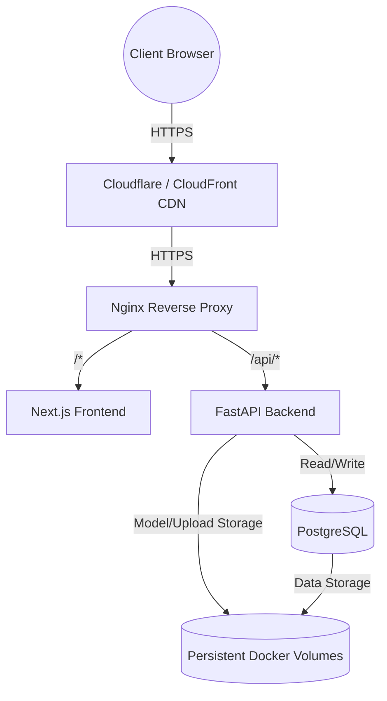

# Cloud Infrastructure & Readiness Guide

This document outlines the cloud infrastructure strategy for deploying Nidaan+ to a production environment like AWS, GCP, or Azure. The application has been containerized and structured to be 100% cloud-ready.

## Architecture Topology

The production architecture is built around Docker Compose and is designed to run seamlessly on a single beefy EC2/Compute instance, or be easily adapted for ECS/Fargate.

## Production Environment Mapping

The environment is separated strictly between development, Docker, and production.
- `.env.development`: Used for local host-based development (SQLite).
- `.env.docker`: Used for `docker compose up` (Postgres inside Docker).
- **Production Secret Injection**: In a cloud environment, `.env.docker` is replaced or augmented by secrets injected from AWS Secrets Manager or GitHub Secrets at deployment time.

## Storage Strategy

Currently, the application relies on Docker Named Volumes for persistence:
1. `pgdata`: PostgreSQL data directory.
2. `nidaan_uploads`: Temporary OCR uploads.
3. `nidaan_reports`: Generated PDF reports.
4. `nidaan_logs`: Structured application logs.
5. `nidaan_ml_models`: Serialized `.joblib` model files.

**AWS Migration (Future Step):**
To scale horizontally, you must move file storage to **Amazon S3**. 
- Replace `app/uploads` and `app/static/generated_reports` logic in FastAPI with `boto3` to stream directly to S3.
- Mount EFS or use S3 for `nidaan_ml_models` if deploying multiple backend replicas.

## Secret Management Strategy

DO NOT commit production secrets to Git.
The following variables must be injected dynamically via CI/CD (GitHub Actions) or fetched at runtime via AWS Parameter Store / Secrets Manager:

- `DATABASE_URL` (Point to AWS RDS instead of internal Docker DB)
- `JWT_SECRET_KEY`
- `RAZORPAY_KEY_ID` & `RAZORPAY_KEY_SECRET`
- `RAZORPAY_WEBHOOK_SECRET`
- `SMTP_PASSWORD`

## Logging & Monitoring Strategy

### Logging
The `docker-compose.prod.yml` enforces the `json-file` logging driver with log rotation (max 20MB per file, 5 files max) to prevent disk space exhaustion.
- **Aggregation**: Run an agent like Datadog, Promtail (Loki), or CloudWatch Agent on the host VM to forward `/var/lib/docker/containers/*/*.log`.

### Health Monitoring
Both the backend and frontend are configured with explicit Docker health checks.
- **Backend Probe**: `GET /api/v1/health/live` ensures the FastAPI server is responsive.
- **Readiness Probe**: `GET /api/v1/health/ready` verifies DB connectivity, filesystem permissions, OCR availability, and ML model loading.
- Tie an AWS Route53 Health Check or ALB Target Group Health Check to `/api/v1/health/ready`.

## Database Backup Strategy

1. **Self-hosted Docker DB**: Schedule a cron job on the host running `docker exec nidaan_db pg_dump -U nidaan_user nidaan_db > backup.sql` and sync it to S3.
2. **Managed DB (Recommended)**: Swap the internal Docker DB for AWS RDS PostgreSQL. RDS provides automated daily snapshots and Point-in-Time Recovery (PITR).

## Nginx & SSL Readiness

The repository includes a production-ready Nginx reverse proxy configuration (`nginx/`).
- Routes traffic correctly between Next.js and FastAPI.
- Implements critical security headers (HSTS, X-Frame-Options, XSS Protection).
- **SSL Termination**: In `docker-compose.prod.yml`, there are commented volume mounts for Let's Encrypt SSL certificates. If deploying behind an AWS Application Load Balancer (ALB), the ALB will handle SSL termination, and Nginx will handle internal routing over port 80.
