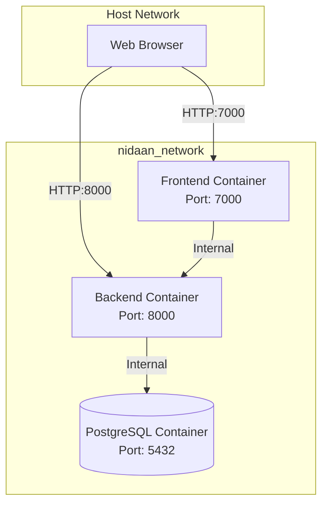
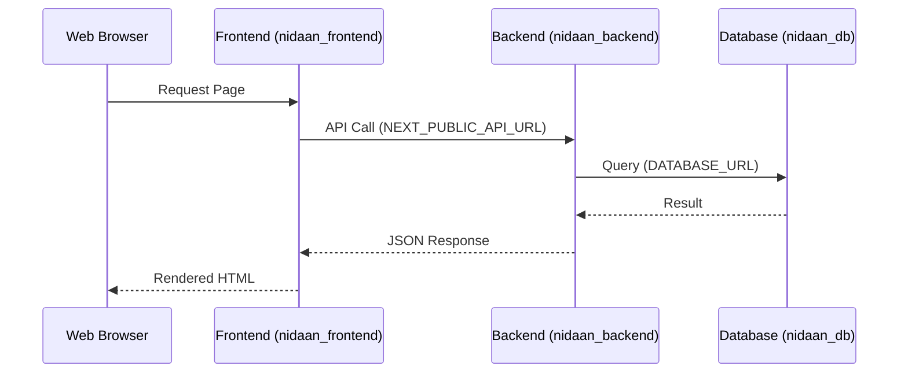
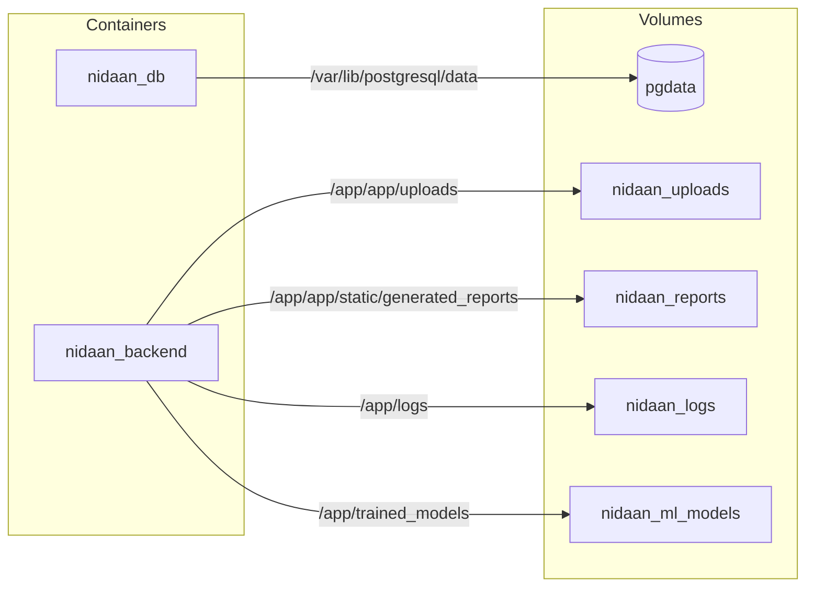

# Nidaan+ Dockerization & Containerization

> Comprehensive guide for building, running, and troubleshooting the Dockerized Nidaan+ application.

---

## Table of Contents

- [Architecture Overview](#architecture-overview)
- [Build Instructions](#build-instructions)
- [Run Instructions](#run-instructions)
- [Health Check Commands](#health-check-commands)
- [Troubleshooting Guide](#troubleshooting-guide)
- [Rollback Instructions](#rollback-instructions)

---

## Architecture Overview

### Docker Architecture Diagram



### Container Communication Diagram



### Volume Diagram



### Network Architecture

- **Network Name**: `nidaan_network` (Bridge Network)
- **Isolation**: Containers communicate internally using service names (`db`, `backend`, `frontend`).
- **Exposed Ports**:
  - Frontend: `7000` (Mapped to host `7000`)
  - Backend: `8000` (Mapped to host `8000`)
  - Database: `5432` (Internal only, not exposed to host for security)

---

## Build Instructions

1. **Verify Environment Files**
   Ensure `.env.docker` is present in the root directory. This is used by `docker-compose.yml`.

2. **Build the Images**
   Run the following command to build the optimized multi-stage images for both backend and frontend:
   ```bash
   docker compose build
   ```

3. **Verify Built Images**
   ```bash
   docker images | grep nidaan
   ```

---

## Run Instructions

1. **Start the Application (Detached Mode)**
   ```bash
   docker compose up -d
   ```

2. **View Running Containers**
   ```bash
   docker compose ps
   ```

3. **Follow Real-time Logs**
   ```bash
   docker compose logs -f
   ```
   To follow logs for a specific service:
   ```bash
   docker compose logs -f backend
   ```

4. **Stop the Application**
   ```bash
   docker compose down
   ```

5. **Stop and Remove Volumes (Full Reset)**
   ```bash
   docker compose down -v
   ```

---

## Health Check Commands

Docker Compose is configured with native health checks. You can verify the health of the system via Docker:

1. **Check Container Health Status**
   ```bash
   docker ps --format "table {{.Names}}\t{{.Status}}"
   ```
   You should see `(healthy)` next to the Up status.

2. **Manual Backend Health Check**
   ```bash
   curl http://localhost:8000/health/live
   ```

3. **Manual Frontend Health Check**
   ```bash
   curl -I http://localhost:7000/
   ```

4. **Manual Database Health Check**
   ```bash
   docker exec -it nidaan_db pg_isready -U nidaan_user -d nidaan_db
   ```

---

## Troubleshooting Guide

### 1. Database Connection Failed
- **Symptoms**: Backend container restarts continuously. Logs show `psycopg2.OperationalError`.
- **Solution**: Check if the `db` container is healthy (`docker compose ps`). Ensure `DATABASE_URL` in `.env.docker` matches the `db` container credentials. The backend will wait until `db` is healthy (via `depends_on`).

### 2. Frontend Cannot Reach Backend
- **Symptoms**: Frontend loads but API calls fail with `Network Error` or `502`.
- **Solution**: Ensure `NEXT_PUBLIC_API_URL` is set to `http://localhost:8000` (for client-side calls). For server-side Next.js fetch calls, use `http://backend:8000` if needed, though client-side requests must resolve via the browser to the host's port 8000.

### 3. OCR (Tesseract) Not Working
- **Symptoms**: PDF parsing fails with "Tesseract not found".
- **Solution**: Verify the backend image built successfully. Tesseract is installed in the final runtime stage of the backend `Dockerfile`. Access the shell and test manually: `docker exec -it nidaan_backend tesseract --version`.

### 4. ML Models Not Found
- **Symptoms**: 500 Error during prediction.
- **Solution**: The `nidaan_ml_models` volume must be populated. You can run the training script inside the container once: `docker exec -it nidaan_backend python -m app.ml.training.train_all`.

---

## Rollback Instructions

If the Docker deployment fails and you need to revert to the manual server setup:

1. Bring down all containers:
   ```bash
   docker compose down
   ```
2. Stop the Docker daemon if necessary.
3. Reactivate the systemd services created in Phase 3 (if applicable):
   ```bash
   sudo systemctl start nidaan-backend
   sudo systemctl start nidaan-frontend
   ```
4. Point Nginx (if configured) back to the local host processes.
5. Alternatively, checkout the `production-hardening` Git branch.
