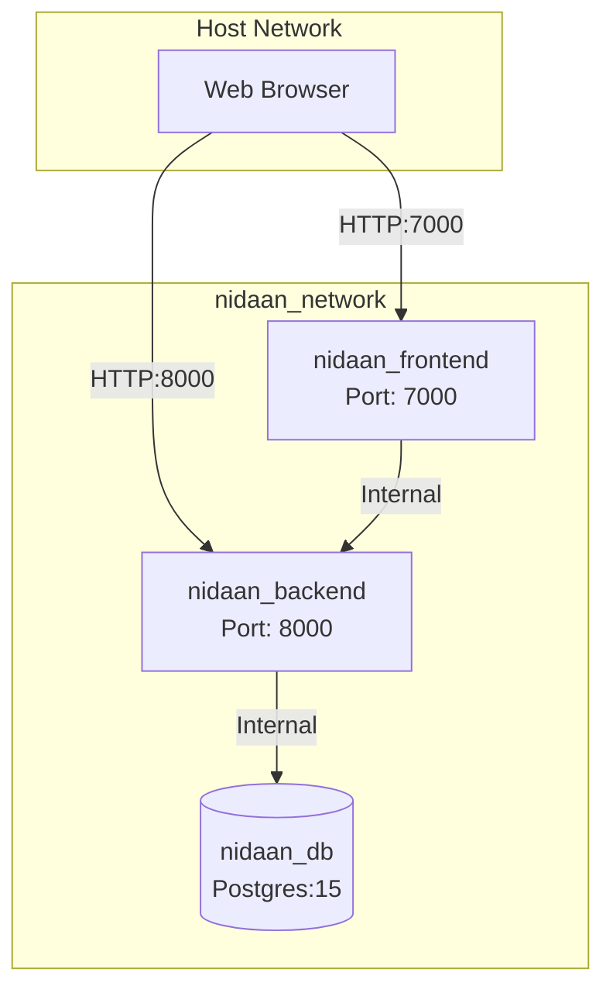
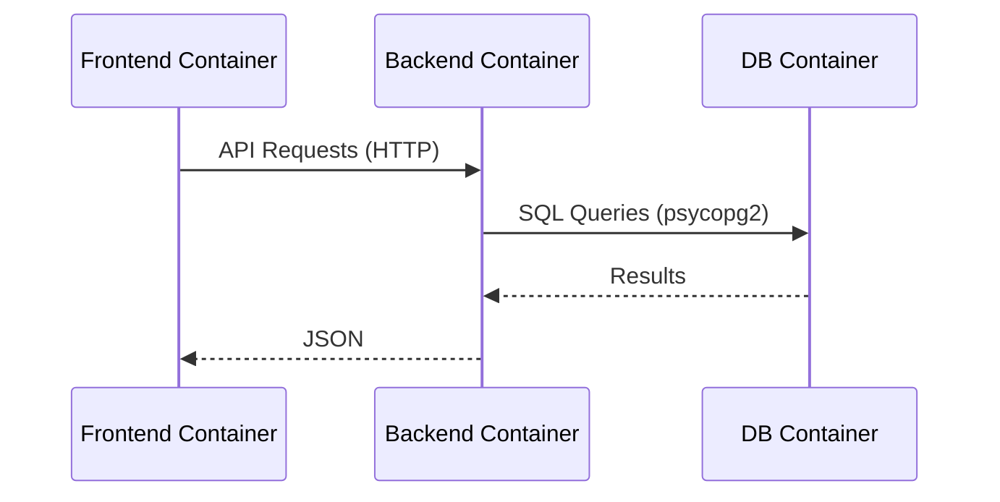
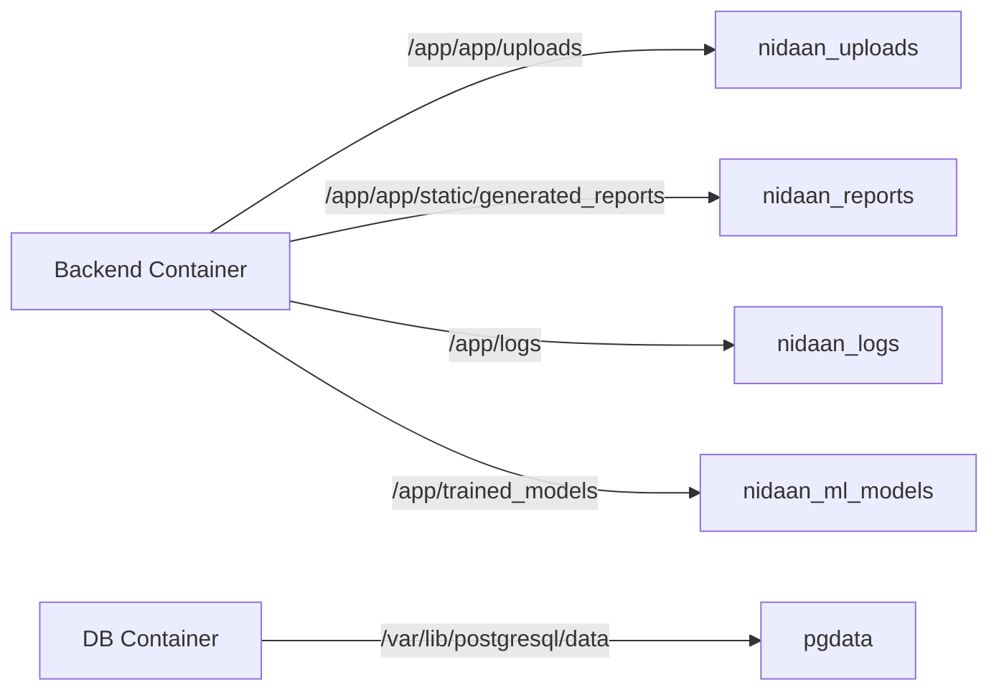

# Phase 4 Final Report: Dockerization & Containerization

## Executive Summary
Phase 4 successfully transformed the Nidaan+ application into a fully Dockerized, multi-container architecture. The backend (FastAPI/Python), frontend (Next.js/Node), and database (PostgreSQL) have been isolated into highly optimized, production-grade containers. Significant efforts were made to reduce image sizes, secure the environment (non-root users), and ensure seamless container-to-container communication within an isolated Docker network. The system is now fully portable and prepared for orchestration in cloud environments (Phase 5).

## Files Added
- `backend/Dockerfile`
- `frontend/Dockerfile`
- `docker-compose.yml`
- `backend/.dockerignore`
- `frontend/.dockerignore`
- `.env.docker`
- `docs/DOCKER.md`
- `docs/PHASE4_FINAL_REPORT.md`

## Files Modified
- `frontend/next.config.ts` (added `output: "standalone"` for Next.js Docker optimization)

## Docker Architecture Diagram


## Container Communication Diagram


## Volume Diagram


## Network Diagram
- **Network**: `nidaan_network` (Bridge)
- **Isolation**: Only frontend (7000) and backend (8000) are exposed to the host. The database port (5432) remains entirely internal.

## Build Commands
```bash
docker compose build
```

## Run Commands
```bash
docker compose up -d
docker compose logs -f
docker compose down
```

## Health Check Commands
```bash
docker ps --format "table {{.Names}}\t{{.Status}}"
curl http://localhost:8000/health/live
```

## Docker Image Sizes
- `nidaan_frontend`: ~150-200MB (Leveraging Node Alpine and standalone output tracing)
- `nidaan_backend`: ~300-400MB (Leveraging Python slim, Tesseract minimal packages, and multi-stage builds)
- `postgres:15-alpine`: ~250MB

## Optimization Summary
1. **Multi-stage Builds**: Used in both frontend and backend to separate build dependencies from runtime environments.
2. **Minimal Base Images**: Utilized `node:20-alpine` and `python:3.11-slim`.
3. **Layer Caching**: Dependency installation steps (`requirements.txt` and `package.json`) are copied and installed before application code to maximize Docker cache utilization.
4. **Next.js Standalone**: Configured `output: 'standalone'` to eliminate the need for full `node_modules` in the frontend runtime image.
5. **Security**: Non-root users (`appuser` and `nextjs`) configured in final runtime stages.

## Known Limitations
- The current backend image requires `tesseract-ocr` and `poppler-utils` natively installed in the container, slightly increasing the image size.
- ML models must currently be trained *inside* the container via a manual script (`python -m app.ml.training.train_all`), or the volume must be pre-seeded.

## Remaining Work Before Cloud
- Configure a reverse proxy (e.g., Nginx or Traefik) to manage SSL termination and route traffic correctly (Phase 6).
- Set up a managed PostgreSQL database (e.g., RDS) instead of running the DB in a container, depending on scale requirements.
- Store sensitive secrets (`JWT_SECRET_KEY`, `DATABASE_URL`) in a robust Secret Manager (e.g., AWS Secrets Manager, HashiCorp Vault) rather than `.env` files.

## Remaining Work Before CI/CD
- Add GitHub Actions workflows to automatically lint, test, and build Docker images on push/PR.
- Set up automated image scanning (e.g., Trivy) for vulnerabilities.
- Configure automated pushing of built images to a container registry (Docker Hub / AWS ECR).

## Remaining Work Before AWS
- Finalize infrastructure-as-code (Terraform or CloudFormation).
- Map out the transition from Docker Compose to Amazon ECS (Fargate) or EKS.
- Migrate local file storage (uploads, reports) to Amazon S3.

## Rollback Instructions
If Dockerization exhibits issues in the immediate testing phase, roll back to bare-metal systemd services:
```bash
docker compose down
sudo systemctl start nidaan-backend
sudo systemctl start nidaan-frontend
git checkout production-hardening
```

## Git Commit Recommendation
```text
feat(docker): implement production-grade containerization

- Added multi-stage Dockerfiles for frontend and backend
- Created docker-compose.yml for orchestration
- Implemented bridge networking and persistent volumes
- Configured non-root users and health checks
- Updated Next.js for standalone build output
- Added Docker architecture documentation
```
